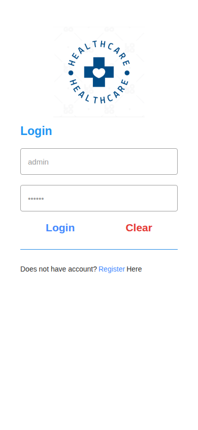
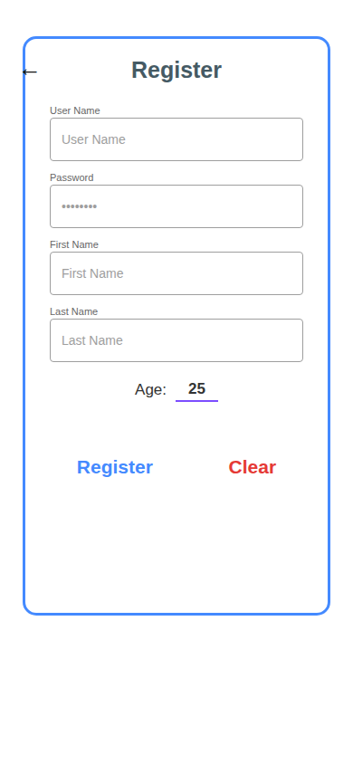
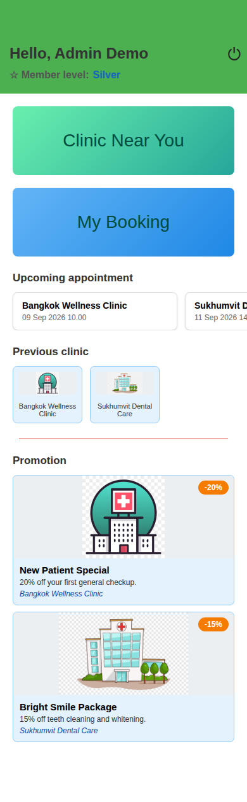
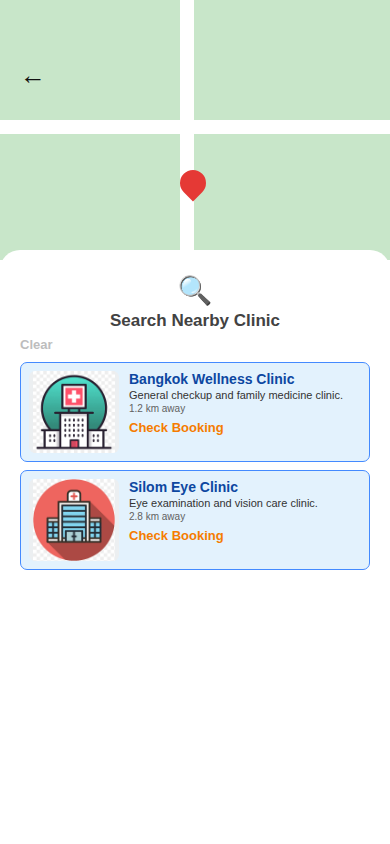
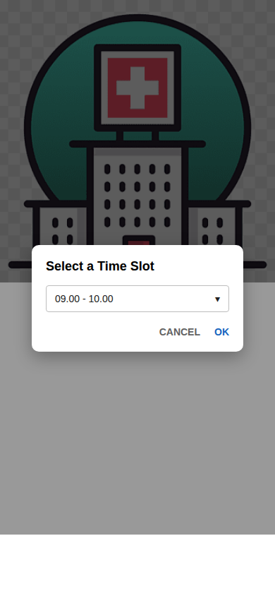
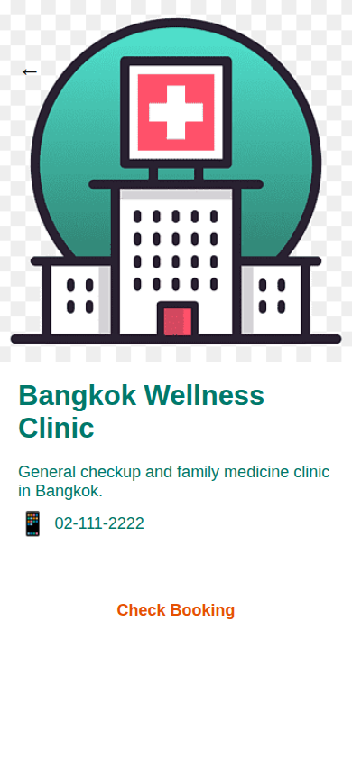
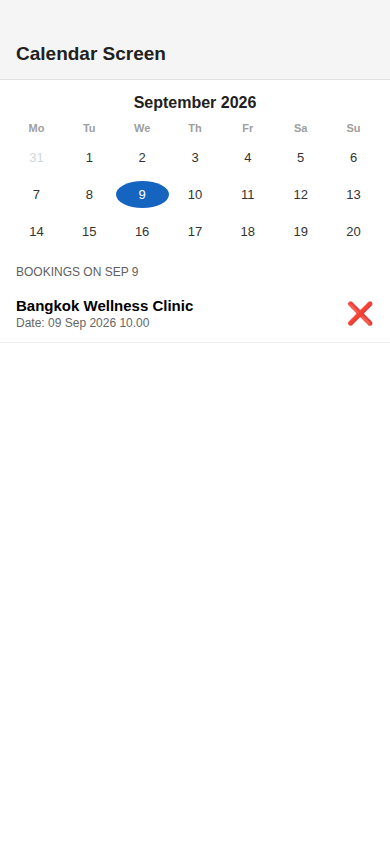

# healthcare_map

A Flutter demo app for a healthcare clinic platform: search nearby clinics, book a time slot, track booking history, and earn loyalty points. It's a portfolio/demo project — all data lives in a local on-device SQLite database (seeded with sample data on first run), so it runs standalone with no backend or account setup required.

## Features

- Login / Register / Logout
- Nearby clinic searching (Google Maps + device GPS location)
- Booking queue (pick a clinic, date, and time slot)
- Upcoming appointment reminder on the dashboard
- Booking history ("Previous clinic") and booking cancellation
- Promotion section
- Loyalty program (Bronze / Silver / Gold tiers based on booking count)

## Screenshots

> **Note:** These are illustrative UI mockups, not real screenshots — this environment has no Flutter SDK/emulator to run the actual app and capture one. Layout and colors are modeled closely on the real widget code. Feel free to replace these with real screenshots after running the app yourself (see [Getting Started](#getting-started)).

| Login | Register | Dashboard |
|---|---|---|
|  |  |  |

| Search Nearby Clinic | Booking Time Slot | Clinic Detail |
|---|---|---|
|  |  |  |

| My Booking (calendar + cancel) |
|---|
|  |

## Tech Stack

- **[Flutter](https://flutter.dev)** (Dart SDK `>=3.2.0 <4.0.0`) — cross-platform UI toolkit (Android, iOS, and desktop targets are all present in the repo)
- **[sqflite](https://pub.dev/packages/sqflite)** — local, on-device SQLite database. This is the app's entire backend: customers, clinics, bookings, and promotions all live in one local `healthcare.db` file that's created and seeded automatically the first time the app runs. There is no server, no auth service, and no network dependency for the core app data.
- **[google_maps_flutter](https://pub.dev/packages/google_maps_flutter)** — renders the map on the "Search Nearby Clinic" screen
- **[location](https://pub.dev/packages/location)** — requests the device's GPS location so nearby clinics can be sorted by real distance
- **[table_calendar](https://pub.dev/packages/table_calendar)** — the calendar widget on the "My Booking" page
- **[intl](https://pub.dev/packages/intl)** — date/time formatting
- **[path](https://pub.dev/packages/path)** — building the on-device database file path

### Project structure

```
healthcare/lib/
├── db/               # DatabaseHelper: schema + demo data seeding (sqflite)
├── model/            # Plain data models + query functions (Customer, Clinic, Booking, Promotion)
├── util/             # Small helpers: date formatting, distance calc, loyalty tier math
├── widget/           # Small shared widgets (skeleton loading placeholders)
└── feature/          # One folder per screen/feature, each with its own presentation/ (and widget/) subfolder
    ├── landingpage/      # Login
    ├── register/
    ├── dashboard/
    ├── searchingpage/    # Map + nearby clinic list
    ├── clinicdetail/     # Clinic detail + time-slot booking
    └── mybooking/        # Calendar + cancel booking
```

## Getting Started

### Prerequisites

- [Flutter SDK](https://docs.flutter.dev/get-started/install) installed and on your `PATH`
- Dart SDK `>=3.2.0` (bundled with Flutter)
- Android Studio / Xcode (for an emulator or simulator) or a physical device — or Android/iOS platform tooling set up for `flutter run`

### Pull and run

```bash
git clone https://github.com/SuruchBoss/healthcare_map.git
cd healthcare_map/healthcare
flutter pub get
flutter run
```

That's it — no `.env` file, API keys, or backend setup needed to try it out. On first launch the app creates its local SQLite database and seeds it with:

- A demo account: **username `admin`, password `admin`**
- 4 sample clinics (with sample photos already bundled in `assets/clinic/`)
- A couple of sample bookings, so the dashboard's "Upcoming appointment" and "Previous clinic" sections aren't empty
- 3 sample promotions

You can also just register a brand-new account from the login screen instead of using the demo one — it's stored locally the same way.

### Building for a real device

```bash
# iOS (requires a Mac + Xcode, and enabling developer mode on the device)
flutter build ios
flutter install

# Android (.apk)
flutter build apk --release
flutter install

# Android App Bundle (Android 10+, for Play Store-style installs)
flutter build appbundle --release
```

### Notes / limitations

- **Maps & location**: the Google Maps API key currently bundled in `android/app/src/main/AndroidManifest.xml` and `ios/Runner/AppDelegate.swift` is a demo key — swap in your own key for anything beyond local testing. The app will also ask for location permission on first visiting the search screen; if you deny it, it falls back to a default Bangkok-area map center.
- **Data is local-only**: bookings, accounts, and history are all stored on-device per install. There's no sync between devices and no real backend — this is intentional, since the project is a demo rather than a production service.

## Usage Walkthrough

1. **Login** — sign in with the demo account (`admin` / `admin`) or tap "Register" to create a new one.
2. **Dashboard** — see your member tier/points, jump into "Clinic Near You" or "My Booking", and scroll down for your upcoming appointment, previously-booked clinics, and current promotions.
3. **Search Nearby Clinic** — opens a map centered on your device's current location (if permission is granted); tap the search icon to reveal the clinic list, sorted by distance.
4. **Book a time slot** — open a clinic (from search, a promotion, or your history), tap "Check Booking", pick a date, then pick an available time slot — slots already booked by anyone at that clinic are shown as unavailable.
5. **My Booking** — a calendar view of your bookings; tap a date to see that day's bookings, and tap the red cancel icon on a booking to cancel it (with a confirmation prompt).
