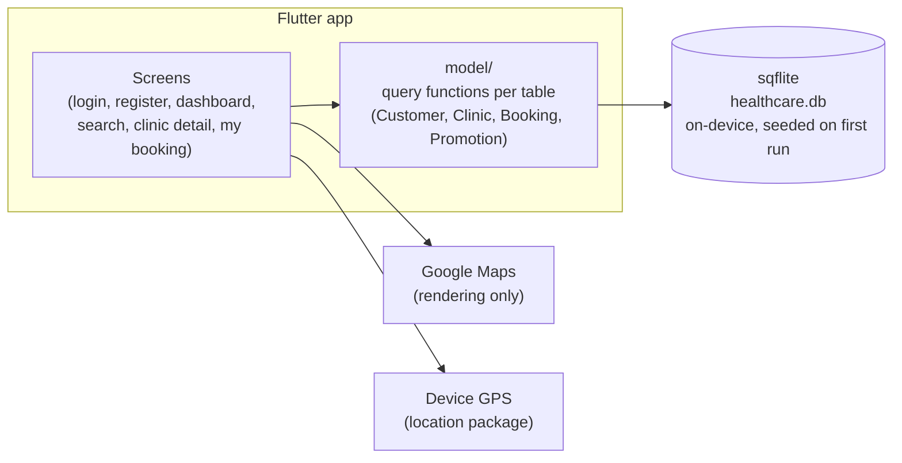

# 🏥 healthcare_map — Clinic Search & Booking App

**Language:** English · [ไทย](#-healthcare_map--แอปค้นหาและจองคิวคลินิก-ภาษาไทย)

> A single-screen-flow Flutter app: register/login → find a nearby clinic on the map → book a real, conflict-checked time slot → track it on a calendar → earn loyalty points.
>
> **Flutter**, no backend — every screen reads and writes a local **sqflite** (SQLite) database on the device.

<p align="center">
  
  
  
  
  
</p>

---

## 📸 Screenshots

> **Note:** These are illustrative UI mockups, not real screenshots — the environment used to write this README has no Flutter SDK or emulator to run the app and capture real ones. They're built from the real widget code (same colors, layout, and bundled clinic images), and clearly labeled as mockups here so nobody mistakes them for the real thing. If you run the app yourself, swap these out for real captures — see [Getting Started](#-getting-started).

| Login | Register | Dashboard |
|---|---|---|
|  |  |  |

| Search Nearby Clinic | Booking a Time Slot | Clinic Detail |
|---|---|---|
|  |  |  |

| My Booking (calendar + cancel) |
|---|
|  |

---

## 📋 Table of Contents

- [Why this project](#-why-this-project)
- [Getting Started](#-getting-started)
- [Features](#-features)
- [Booking rules](#-booking-rules)
- [Tech Stack](#-tech-stack)
- [Architecture](#-architecture)
- [Project Structure](#-project-structure)
- [Known limitations / what's next](#-known-limitations--whats-next)

---

## 🎯 Why this project

This started as a course/portfolio project, then its Firebase backend project got deleted. Rather than recreate a Firebase project (which would just move the same problem to a different cloud dashboard), the backend was rebuilt as a **local, on-device SQLite database** — since the goal here is a runnable portfolio demo, not a production multi-user service. That constraint shaped the rest of the work:

- No server to stand up, no `.env` file, no API key to request before someone can `git clone` and `flutter run` it.
- Every screen's data (customers, clinics, bookings, promotions) lives in one seeded `healthcare.db` file created on first launch.
- Real product logic still had to hold up without a backend to lean on: booking slots have to actually conflict-check against each other, a booking has to belong to a specific logged-in customer (not just "whichever data is in the database"), and a cancelled booking has to disappear from every screen that showed it.

A second theme running through this repo's history: several screens originally had UI but no logic wired behind them (a "Previous clinic" list that just showed every clinic, a "Member level" badge that was a static, non-clickable string, a `location` GPS package that was a dependency but never imported anywhere). Part of this project's work was going screen by screen and making each one do what it visually claims to do.

---

## 🚀 Getting Started

### Prerequisites

| Tool | Version | Check with |
|---|---|---|
| [Flutter SDK](https://docs.flutter.dev/get-started/install) | Dart `>=3.2.0 <4.0.0` | `flutter --version` |
| Android Studio / Xcode, an emulator/simulator, or a physical device | — | `flutter devices` |

### Pull and run

```bash
git clone https://github.com/SuruchBoss/healthcare_map.git
cd healthcare_map/healthcare
flutter pub get
flutter run
```

That's the whole setup — no backend to start, no `.env` file, no API key to plug in first. On first launch the app creates its local SQLite database and seeds it with:

- A demo account: **username `admin`, password `admin`**
- 4 sample clinics (using the photos already bundled in `assets/clinic/`)
- A couple of sample bookings, so "Upcoming appointment" and "Previous clinic" on the dashboard aren't empty on first run
- 3 sample promotions

You can also just register a brand-new account from the login screen instead of using the demo one — it's stored the same way, locally.

### 🗺 A 3-minute tour

1. **Log in** with `admin` / `admin` (or register a new account).
2. **Dashboard** — your member tier/points badge is tappable and shows your progress to the next tier; below that, your upcoming appointment, previously-booked clinics, and current promotions.
3. Tap **"Clinic Near You"** → grant location access (or don't — it falls back to a default map center either way) → the clinic list is right there, sorted by real distance from you.
4. Tap a clinic → **"Check Booking"** → pick a date (today up to 60 days ahead) → pick a time slot. Slots someone else already booked at that clinic show as unavailable.
5. Confirm the booking, then open **"My Booking"** from the dashboard — tap a date on the calendar to see that day's bookings, and tap the red ✕ to cancel one (with a confirmation prompt first).
6. Back on the dashboard, notice the tier badge and "Previous clinic" list updated — they refresh whenever you come back from booking or cancelling something.

### Building for a real device

```bash
# iOS (requires a Mac + Xcode; enable developer mode on the device first)
flutter build ios
flutter install

# Android (.apk)
flutter build apk --release
flutter install

# Android App Bundle (Android 10+, for Play Store-style installs)
flutter build appbundle --release
```

### 🔧 Troubleshooting

<details>
<summary>Click to expand</summary>

| Symptom | Cause | Fix |
|---|---|---|
| Build fails looking for Firebase config | You're on an older commit, before this app moved off Firebase | Pull the latest `main`/`develop` — Firebase was fully removed in favor of local sqflite |
| Map is blank / grey | Missing or restricted Google Maps API key | Swap in your own key (see [Notes on the Maps key](#-known-limitations--whats-next) below) |
| "Location permission denied" banner on the search screen | You declined the location prompt | Expected — the app falls back to a default map center; you can still search, just not sorted by real distance |
| `flutter run` complains about the Dart SDK version | Flutter is older than what `pubspec.yaml` requires | `flutter upgrade` |
| Want to reset all local data | The app never asked to clear it | Uninstall/reinstall the app (or clear app data on Android) — the SQLite file lives in the app's local storage and re-seeds itself on next launch |

</details>

---

## ✨ Features

- **Login / Register / Logout** — accounts are stored locally; usernames must be unique (registering a taken username shows a dialog instead of crashing)
- **Nearby clinic search** — a Google Map centered on the device's real GPS location (when granted), with the clinic list sorted by actual distance
- **Time-slot booking** — pick any date up to 60 days out; available slots are computed from real existing bookings at that clinic, not randomly
- **My Booking** — a calendar of your bookings, with a cancel action (confirmation required) per booking
- **Upcoming appointment** reminder on the dashboard — always your own, nearest upcoming booking
- **Previous clinic** — your real booking history, most recently booked first (not just "every clinic in the database")
- **Promotions** — seeded discount offers linked to a specific clinic
- **Loyalty program** — Bronze / Silver / Gold tier and points computed from how many times you've booked, with a dialog showing progress to the next tier

---

## 📅 Booking rules

The booking flow has real constraints behind it, not just a form that always succeeds:

1. **Time slots run 07:00–21:00**, in 1-hour blocks (14 slots/day) — see `generateTimeSlots()` in `clinic_detail_page.dart` / `search_list.dart`.
2. **You can book from today up to 60 days ahead** — no booking in the past (`showDatePicker`'s `firstDate` is "now").
3. **A slot already taken at that clinic is unavailable to everyone**, not just to the customer who booked it — `getBookedTimesForClinic()` in `lib/model/bookingmodel.dart` checks every booking for that clinic on that date, regardless of who made it. If every slot on a date is taken, you get a "Fully booked" dialog instead of an empty dropdown.
4. **A booking belongs to exactly one customer** (`Bookings.customerId`, a foreign key to `Customers`) — your calendar, "Previous clinic" history, and loyalty points only ever reflect your own bookings, never another account's.
5. **Cancelling is a real delete**, guarded by a confirmation dialog, and every dashboard widget that shows booking-derived data (tier, history, upcoming appointment) recomputes itself the next time you land back on the dashboard.

---

## 🛠 Tech Stack

| Technology | What it's used for |
|---|---|
| **[Flutter](https://flutter.dev)** (Dart `>=3.2.0 <4.0.0`) | Cross-platform UI — Android, iOS, and desktop build targets are all present in the repo |
| **[sqflite](https://pub.dev/packages/sqflite)** | The entire backend. `Customers`, `Clinics`, `Bookings`, and `Promotions` all live in one on-device `healthcare.db` file, created and seeded automatically on first run |
| **[google_maps_flutter](https://pub.dev/packages/google_maps_flutter)** | Renders the map on the "Search Nearby Clinic" screen |
| **[location](https://pub.dev/packages/location)** | Requests the device's GPS position so nearby clinics can be sorted by real distance |
| **[table_calendar](https://pub.dev/packages/table_calendar)** | The calendar widget on "My Booking" |
| **[intl](https://pub.dev/packages/intl)** | Date/time formatting |
| **[path](https://pub.dev/packages/path)** | Builds the on-device database file path |

State management is plain `StatefulWidget` + `setState` throughout — no Provider/Riverpod/Bloc/GetX. For an app this size (a handful of screens, no cross-cutting shared state beyond "who's logged in," which is just passed down as a constructor argument) that's a deliberate, appropriately-sized choice rather than a gap.

### Design system

Every screen shares one small design system defined in `lib/theme/app_theme.dart` — `AppColors` (a trustworthy blue primary, a teal accent for positive/distance signals, a soft neutral page background so white cards read as distinct surfaces) and an `AppTheme.theme` wired into `MaterialApp`. Screens used to each pick their own color (a green dashboard header, a blue banner, teal clinic-detail text, an orange CTA, a red divider — no relationship between any of them); they now all pull from the same palette, and primary actions (Login, Register, Check Booking) are real filled buttons instead of colored text.

---

## 🏛 Architecture



There's no client/server split here — `model/` functions (`getClinics()`, `addBooking()`, `getBookingCount()`, …) are called directly from widgets and talk straight to `sqflite`. The only things that leave the device at all are map tiles from Google Maps and the GPS fix from the OS; no app data (accounts, bookings) is ever sent anywhere.

Within `lib/`, each screen is a self-contained **feature folder** (`lib/feature/<name>/presentation/`, with a `widget/` subfolder for that screen's own small pieces), while `model/`, `db/`, `util/`, and `widget/` at the top level hold code shared across features. It's a much flatter structure than a layered/Clean Architecture split — appropriate for an app where there's no backend boundary to isolate behind an interface, and no swappable data source to justify a repository abstraction.

---

## 📁 Project Structure

```
healthcare_map/
├── README.md
├── docs/
│   └── screenshots/                  # UI mockups used in this README
└── healthcare/                       # the Flutter project itself
    ├── lib/
    │   ├── main.dart
    │   ├── db/
    │   │   └── database_helper.dart  # schema + demo data seeding (sqflite)
    │   ├── model/                    # data classes + query functions
    │   │   ├── customermodel.dart
    │   │   ├── clinicmodel.dart
    │   │   ├── bookingmodel.dart
    │   │   └── promotionmodel.dart
    │   ├── util/                     # small pure helpers
    │   │   ├── datetime.dart         # date formatting
    │   │   ├── distance.dart         # haversine distance calc
    │   │   ├── findevent.dart        # "nearest upcoming booking" query
    │   │   └── loyalty.dart          # tier/points calculation
    │   ├── theme/
    │   │   └── app_theme.dart        # AppColors + AppTheme — the app's one shared design system
    │   ├── widget/
    │   │   └── skeleton_loader.dart  # loading placeholders (used instead of bare spinners)
    │   └── feature/                  # one folder per screen
    │       ├── landingpage/          # login
    │       ├── register/
    │       ├── dashboard/
    │       │   └── presentation/widget/   # clinic_history, clinic_promotion, upcomingevent
    │       ├── searchingpage/        # map + nearby clinic list
    │       │   └── presentation/widget/search_list.dart
    │       ├── clinicdetail/         # clinic detail + time-slot booking dialog
    │       └── mybooking/            # calendar + cancel booking
    ├── android/ ios/ linux/ macos/ windows/   # Flutter platform scaffolding
    ├── assets/                       # logo, clinic photos, banner images
    └── pubspec.yaml
```

---

## ⚠️ Known limitations / what's next

Being upfront about these rather than letting them surface as surprises:

- **Passwords are stored and compared as plain text** in the local database. Fine for a local, single-device demo; not something to carry into anything real without hashing (e.g. `bcrypt`) first.
- **The Google Maps API key** bundled in `android/app/src/main/AndroidManifest.xml` and `ios/Runner/AppDelegate.swift` is a demo key with no usage guarantees — swap in your own for anything beyond local testing.
- **No automated test suite.** `test/widget_test.dart` is still the stock counter-app test `flutter create` generates — it references UI that no longer exists in this app and doesn't currently pass. Real widget/unit tests for the booking flow and loyalty math would be the highest-value addition here.
- **A few dead ends from earlier iterations remain** — e.g. a commented-out "find nearby restaurants via HTTP" experiment in `searchingpage.dart` that was superseded by the current Google Maps + local-clinic-list approach, left in as a comment rather than deleted.
- **Everything is local-only, by design** — there's no sync between devices and no way for two people to see each other's bookings. Turning this into a real multi-user service would mean bringing back a real backend (this time with a database that survives a dashboard being deleted out from under it).

---

---

# 🏥 healthcare_map — แอปค้นหาและจองคิวคลินิก (ภาษาไทย)

**ภาษา:** [English](#-healthcare_map--clinic-search--booking-app) · ไทย

> แอป Flutter ที่ครบวงจรเดียว: สมัคร/ล็อกอิน → หาคลินิกใกล้ตัวบนแผนที่ → จองคิวแบบเช็คช่วงเวลาชนกันจริง → ติดตามบนปฏิทิน → สะสมแต้ม
>
> **Flutter ล้วน ไม่มี backend** — ทุกหน้าจออ่าน/เขียนฐานข้อมูล **sqflite** (SQLite) ในเครื่องโดยตรง

## 📸 ภาพหน้าจอ

> **หมายเหตุ:** ภาพเหล่านี้เป็น **UI mockup จำลอง ไม่ใช่ภาพแคปจริงจากแอป** — เครื่องที่ใช้เขียน README นี้ไม่มี Flutter SDK/emulator ให้รันแอปเพื่อแคปจอจริง ภาพวาดจากโค้ด widget จริง (สี, เลย์เอาต์, รูปคลินิกที่ bundle มากับโปรเจกต์) แต่ยังไงก็ตามให้ถือว่าเป็นภาพจำลองเท่านั้น ถ้ารันแอปเองแล้วอยากได้ภาพจริง แทนที่ไฟล์ใน `docs/screenshots/` ได้เลย

ดูภาพตัวอย่างด้านบน (ส่วนภาษาอังกฤษ) — ใช้ภาพชุดเดียวกัน

## 🎯 ทำไมถึงทำโปรเจกต์นี้

โปรเจกต์นี้เริ่มจากงานเรียน/portfolio จากนั้น Firebase project ที่ใช้เป็น backend ถูกลบไป แทนที่จะสร้าง Firebase project ใหม่ (ซึ่งจะย้ายปัญหาเดิมไปไว้ที่ dashboard คลาวด์อีกที) เลยเปลี่ยนมาทำ backend เป็น **SQLite local บนเครื่อง** แทน เพราะเป้าหมายจริงๆ คือให้เป็นเดโม่ที่รันดูได้ ไม่ใช่ระบบ production หลายผู้ใช้ ผลจากข้อจำกัดนี้:

- ไม่ต้องตั้ง server, ไม่ต้องมีไฟล์ `.env`, ไม่ต้องขอ API key ก่อน `git clone` แล้ว `flutter run` ได้เลย
- ข้อมูลทุกหน้าจอ (ลูกค้า, คลินิก, การจอง, โปรโมชั่น) อยู่ในไฟล์ `healthcare.db` ไฟล์เดียวที่ seed ให้อัตโนมัติตอนเปิดแอปครั้งแรก
- ตรรกะการทำงานยังต้องถูกต้องแม้ไม่มี backend คอยช่วย — ช่วงเวลาจองต้องเช็คชนกันจริง, การจองต้องผูกกับบัญชีที่ล็อกอินอยู่จริง (ไม่ใช่ "ข้อมูลอะไรก็ได้ในฐานข้อมูล"), และการยกเลิกจองต้องหายไปจากทุกหน้าจอที่เคยแสดงมันอยู่

อีกประเด็นที่เจอในโค้ดตั้งแต่แรก: หลายหน้าจอมี UI ไว้แล้วแต่ยังไม่มี logic จริงข้างหลัง (เช่น "Previous clinic" ที่โชว์คลินิกทั้งหมดเหมือน list อื่น, ป้าย "Member level" ที่เป็นข้อความนิ่งกดไม่ได้ทำอะไร, package `location` ที่ import ไว้ใน pubspec แต่ไม่เคยถูกเรียกใช้จริงเลย) งานส่วนหนึ่งของโปรเจกต์นี้คือไล่ทีละหน้าจอให้มันทำงานตามที่ UI มันบอกจริงๆ

## 🚀 วิธีรัน

### ต้องมี

| เครื่องมือ | เวอร์ชัน | ตรวจด้วย |
|---|---|---|
| [Flutter SDK](https://docs.flutter.dev/get-started/install) | Dart `>=3.2.0 <4.0.0` | `flutter --version` |
| Android Studio / Xcode + emulator/simulator หรือเครื่องจริง | — | `flutter devices` |

### ดาวน์โหลดมารัน

```bash
git clone https://github.com/SuruchBoss/healthcare_map.git
cd healthcare_map/healthcare
flutter pub get
flutter run
```

จบแค่นี้ครับ — ไม่ต้องเปิด backend, ไม่ต้องมี `.env`, ไม่ต้องหา API key มาใส่ก่อน ตอนเปิดแอปครั้งแรก แอปจะสร้างฐานข้อมูล SQLite ในเครื่องและ seed ข้อมูลให้ทันที:

- บัญชีเดโม่: **username `admin`, password `admin`**
- คลินิกตัวอย่าง 4 แห่ง (ใช้รูปที่ bundle มาใน `assets/clinic/` อยู่แล้ว)
- การจองตัวอย่างสองสามรายการ ให้ "Upcoming appointment" กับ "Previous clinic" ไม่ว่างเปล่าตั้งแต่เปิดแอปครั้งแรก
- โปรโมชั่นตัวอย่าง 3 รายการ

หรือจะสมัครบัญชีใหม่จากหน้า login เองก็ได้ เก็บแบบเดียวกันคือ local ในเครื่อง

### 🗺 ทัวร์ 3 นาที

1. **ล็อกอิน** ด้วย `admin` / `admin` (หรือสมัครใหม่)
2. **Dashboard** — ป้าย tier/แต้มสะสมกดได้ กดแล้วเห็นว่าต้องจองอีกกี่ครั้งถึงจะขึ้น tier ถัดไป ด้านล่างมีนัดหมายที่จะถึง, คลินิกที่เคยจอง, และโปรโมชั่นปัจจุบัน
3. กด **"Clinic Near You"** → อนุญาตตำแหน่ง (หรือไม่อนุญาตก็ได้ แอปจะ fallback ไปจุดกลางเริ่มต้น) → เห็นรายชื่อคลินิกเรียงตามระยะทางจริงทันที ไม่ต้องกดอะไรเพิ่ม
4. แตะคลินิก → **"Check Booking"** → เลือกวันที่ (วันนี้ถึงล่วงหน้า 60 วัน) → เลือกช่วงเวลา ช่วงที่คนอื่นจองไปแล้วที่คลินิกนั้นจะขึ้นไม่ว่าง
5. ยืนยันการจอง แล้วเปิด **"My Booking"** จาก dashboard — แตะวันบนปฏิทินเพื่อดูการจองวันนั้น แตะ ✕ สีแดงเพื่อยกเลิก (มี dialog ยืนยันก่อนเสมอ)
6. กลับมาที่ dashboard จะเห็นป้าย tier กับ "Previous clinic" อัปเดตให้เอง — รีเฟรชทุกครั้งที่กลับมาจากหน้าจอง/ยกเลิก

## ✨ ฟีเจอร์

- **Login / Register / Logout** — username ต้องไม่ซ้ำ (สมัครซ้ำจะขึ้น dialog แทนที่จะแอป crash)
- **ค้นหาคลินิกใกล้ตัว** — แผนที่ Google Maps ที่จุดกลางเป็นตำแหน่ง GPS จริงของเครื่อง (ถ้าอนุญาต) รายชื่อคลินิกเรียงตามระยะทางจริง
- **จองช่วงเวลา** — เลือกวันล่วงหน้าได้ถึง 60 วัน ช่วงเวลาที่ว่างคำนวณจากการจองจริงในฐานข้อมูล ไม่ใช่สุ่ม
- **My Booking** — ปฏิทินการจองของตัวเอง พร้อมปุ่มยกเลิก (มี dialog ยืนยัน)
- **แจ้งเตือนนัดหมายที่จะถึง** บน dashboard — เป็นของบัญชีตัวเองเสมอ
- **ประวัติคลินิก (Previous clinic)** — คลินิกที่เคยจองจริง เรียงจากล่าสุด
- **โปรโมชั่น** — ข้อเสนอส่วนลดที่ผูกกับคลินิกที่ระบุ
- **ระบบสะสมแต้ม** — คำนวณ tier Bronze/Silver/Gold และแต้มจากจำนวนครั้งที่จองจริง พร้อม dialog บอกความคืบหน้าไปยัง tier ถัดไป

## 📅 กฎการจอง

1. **ช่วงเวลาบริการ 07:00–21:00** แบ่งเป็นช่วงละ 1 ชั่วโมง (14 ช่วง/วัน)
2. **จองล่วงหน้าได้ถึง 60 วัน** เลือกย้อนหลังไม่ได้
3. **ช่วงเวลาที่มีคนจองแล้วที่คลินิกนั้นจะไม่ว่างสำหรับทุกคน** ไม่ใช่แค่คนที่จองไป — เช็คจากการจองจริงทุกรายการของคลินิกนั้นในวันนั้น ถ้าเต็มทุกช่วงจะขึ้น "Fully booked" แทนดรอปดาวน์ว่างเปล่า
4. **การจองผูกกับบัญชีเดียว** (`Bookings.customerId`) — ปฏิทิน, ประวัติ, แต้มสะสม เห็นเฉพาะของตัวเอง ไม่ปนกับบัญชีอื่น
5. **การยกเลิกคือลบจริง** มี dialog ยืนยันก่อนเสมอ และทุก widget บน dashboard ที่ใช้ข้อมูลการจองจะคำนวณใหม่ทุกครั้งที่กลับมาที่หน้า dashboard

## 🛠 เทคโนโลยีที่ใช้

ดูตารางเต็มในส่วนภาษาอังกฤษด้านบน — สรุปสั้นๆ: **Flutter** + **sqflite** (backend ทั้งหมด) + **google_maps_flutter** + **location** (GPS) + **table_calendar** + **intl** ไม่มี state management library ภายนอก ใช้ `StatefulWidget`/`setState` ธรรมดา ซึ่งเหมาะสมกับขนาดแอปนี้ (ไม่กี่หน้าจอ ไม่มี shared state ข้าม feature ที่ซับซ้อน)

**Design system**: ทุกหน้าจอใช้ธีมสีเดียวกันจาก `lib/theme/app_theme.dart` (`AppColors` + `AppTheme`) — น้ำเงินเป็นสีหลัก (ความน่าเชื่อถือ, เหมาะกับแอปสุขภาพ), เขียวมิ้นท์เป็น accent (ระยะทาง/สัญญาณเชิงบวก), พื้นหลังเทาอ่อนให้การ์ดขาวเด่น เดิมแต่ละหน้าจอเลือกสีเอง (header เขียว, banner น้ำเงิน, ตัวอักษร clinic detail เขียว, ปุ่มส้ม, เส้นแบ่งแดง — ไม่มีความสัมพันธ์กันเลย) ตอนนี้ทุกที่ดึงจากพาเลตต์เดียวกัน และปุ่มหลัก (Login, Register, Check Booking) เป็นปุ่มจริงแทนข้อความสี

## ⚠️ ข้อจำกัดที่รู้อยู่แล้ว / สิ่งที่ทำต่อได้

- **รหัสผ่านเก็บเป็น plain text** ในฐานข้อมูล local — โอเคสำหรับเดโม่เครื่องเดียว แต่ไม่ควรเอาไปใช้จริงโดยไม่เข้ารหัสก่อน (เช่น bcrypt)
- **Google Maps API key** ที่ bundle มาเป็น key เดโม่ ไม่มีการรับประกันการใช้งาน — ควรเปลี่ยนเป็น key ของตัวเองถ้าจะใช้งานจริงจัง
- **ยังไม่มีชุดทดสอบอัตโนมัติ** — `test/widget_test.dart` ยังเป็น test ของ counter app เริ่มต้นจาก `flutter create` ที่อ้างถึง UI ที่ไม่มีอยู่แล้วในแอปนี้ และไม่ผ่านในสภาพปัจจุบัน
- **มีโค้ดที่ทดลองไว้แล้วเลิกใช้หลงเหลืออยู่** เช่น โค้ด comment ทดลองเรียก HTTP หา "ร้านใกล้เคียง" ใน `searchingpage.dart` ที่ถูกแทนที่ด้วยแนวทาง Google Maps + รายชื่อคลินิกใน local DB ที่ใช้อยู่ปัจจุบัน
- **ทุกอย่าง local-only โดยตั้งใจ** — ไม่มีการ sync ข้ามเครื่อง ถ้าจะทำเป็นระบบ multi-user จริงต้องกลับไปมี backend จริง (รอบนี้ควรมีฐานข้อมูลที่ไม่หายไปพร้อม dashboard ที่ถูกลบ)
